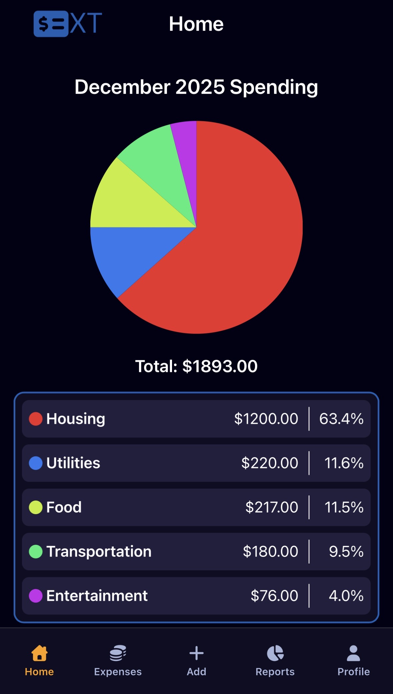
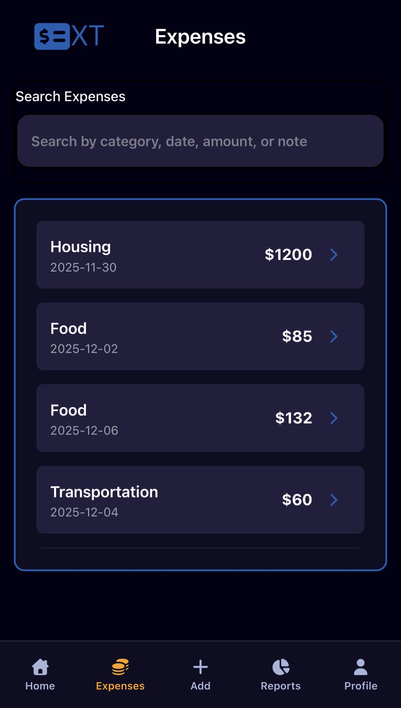
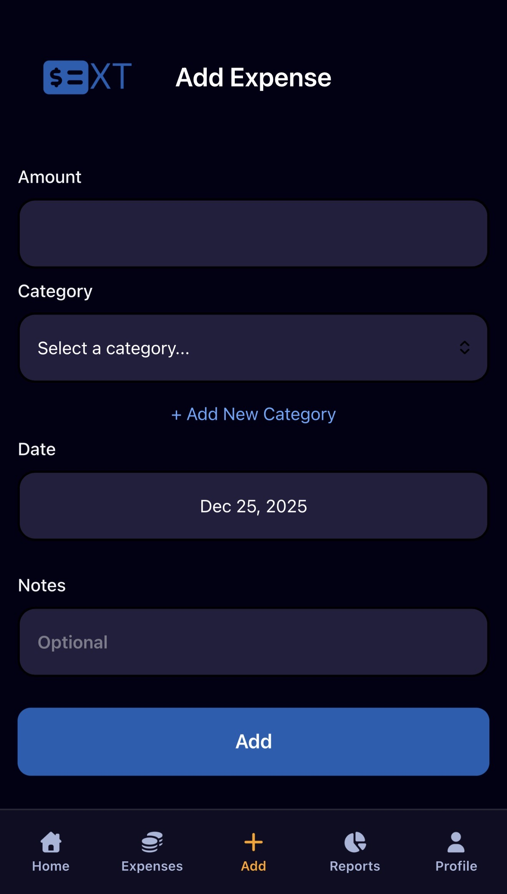

# Expense Tracker

A comprehensive mobile expense tracking application built with React Native and Expo. This app helps users manage their finances by tracking expenses, categorizing spending, and visualizing financial data through charts and reports.

## Live Demo

**[View Web App](https://expense-tracker-59s.pages.dev/)**

> **Note:** This application was primarily designed for mobile devices (iOS/Android) but is also available as a web application. For the best experience, please use a mobile device or enable mobile view in your browser's developer tools.

## Screenshots

  
  
  

## Features

- **Home Page** - View spending overview and recent transactions at a glance
- **Expense Tracking** - Easily add, edit, and delete expenses with detailed information
- **Category Management** - Organize expenses by custom categories
- **Analytics & Reports** - Visualize spending patterns with pie charts and detailed breakdowns
- **User Authentication** - Secure sign-up and login functionality
- **User Profiles** - Manage personal account information and preferences
- **Date Filtering** - View expenses by date range with period-based analysis
- **Responsive UI** - Intuitive interface optimized for mobile devices

## Tech Stack

- **React Native** - Cross-platform mobile framework for iOS and Android
- **Expo** - Development platform and build service
- **TypeScript** - Type-safe JavaScript development
- **Expo Router** - File-based routing for React Native
- **Appwrite** - Backend-as-a-service for authentication, database, and file storage
- **NativeWind** - Tailwind CSS styling for React Native

## License

This project is open source and available under the MIT License.

## Contact

For questions or feedback, please reach out via GitHub or visit the repository at [craigardy/expense-tracker](https://github.com/craigardy/expense-tracker).
